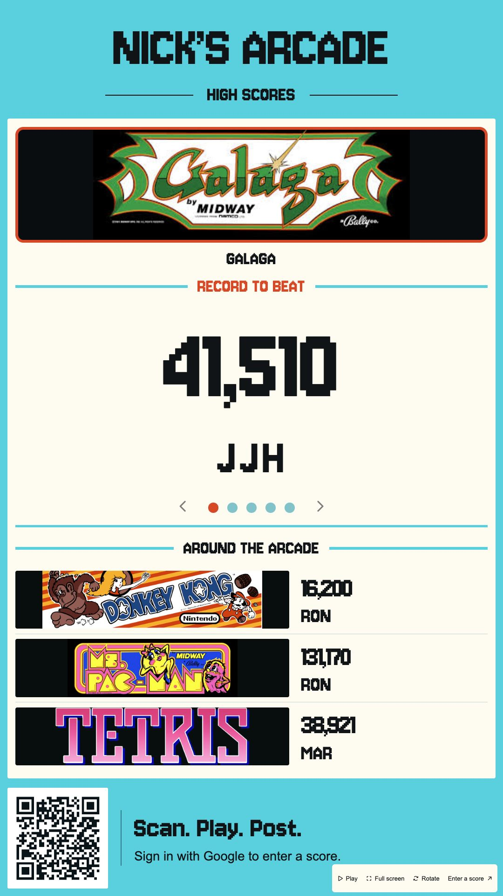
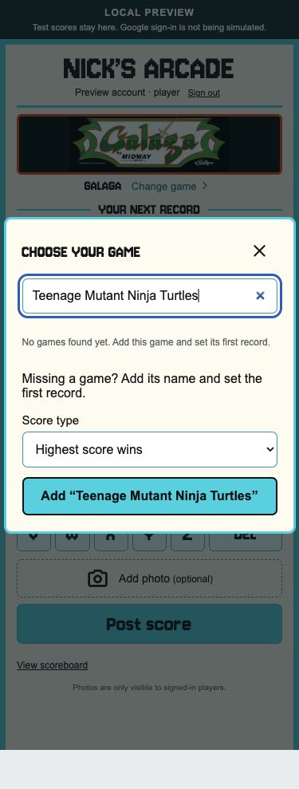

# Nick’s Arcade

A shared high-score board for Nick’s basement arcade: a rotating portrait display for the TV, and an arcade-style score-entry screen for friends’ phones.

**[Open the TV scoreboard](https://ronavis.github.io/nicks-arcade/#tv) · [Enter a score](https://ronavis.github.io/nicks-arcade/#play)**

> **Source status — September 29, 2026:** The rebuilt app is deployed. Its current source is on [`codex/arcade-record-spotlight`](https://github.com/ronavis/nicks-arcade/tree/codex/arcade-record-spotlight), in [pull request #1](https://github.com/ronavis/nicks-arcade/pull/1). Until that PR is merged, `master` still contains the original implementation. GitHub Pages serves the separate `gh-pages` branch. Use the source branch below for local development.

## Screenshots

<table>
  <tr>
    <th>Portrait scoreboard</th>
    <th>Arcade score entry</th>
    <th>Add a missing game</th>
  </tr>
  <tr>
    <td align="center" valign="top"><a href="docs/screenshots/tv-scoreboard.png"></a></td>
    <td align="center" valign="top"><a href="docs/screenshots/mobile-score-entry.png"></a></td>
    <td align="center" valign="top"><a href="docs/screenshots/add-game.png"></a></td>
  </tr>
</table>

Click a screenshot to open the full-resolution PNG. The TV image is captured from the live site at **1080 × 1920**. Phone images show the current app in its labeled local preview with example initials and an unsubmitted score; no live records were created for these screenshots. Captured September 29, 2026.

## How to play

1. Scan the QR code on the scoreboard, or open the score-entry link.
2. Sign in with Google. Your email does not appear on the public scoreboard.
3. Search for your game. If it is missing, enter its name and choose **Add**. Select whether the highest score or fastest time wins.
4. Enter your score and tap three letters on the arcade alphabet keypad. Use **DEL** to correct an initial.
5. Optionally attach a photo, then choose **Post score**.

Submissions do not wait for approval. A game’s first score becomes its record to beat. Later submissions replace the record only when they beat it; lower scores remain in history, and an equal score keeps the earlier entry. The public TV board refreshes every five seconds while its browser tab is visible.

Ron is the initial administrator. Admin controls allow score corrections, removal, proof-photo viewing and a JSON export. Removing a winning score promotes the best remaining entry, and changes are retained in the audit history.

## Your account, notifications and friendly rivalry

**My account** is visible near the top of score entry and in the TV controls. When signed out, it takes you to Google sign-in; when signed in, it opens your account. It provides:

- **Notifications:** recent score submissions, first records and record breaks, with an unread badge and **Mark all read**. A player whose account held the previous record sees **Your record was broken**, the new score, previous record and challenger’s optional taunt.
- **My scores:** your latest 100 submissions and linked imported records, current-record status, removed-entry status and attached proof photos.
- **Settings:** save three default initials for fresh entries. Admins can also save the shared TV rotation interval (5–120 seconds). Open displays receive timing changes within five seconds, and the setting survives restarts. Preferences and notification read status follow your Google account across devices.
- **Manage scores:** a prominent shortcut for admins. Corrections can also edit or clear a taunt.

The optional **Victory taunt** is limited to 140 characters. Keep it friendly. Text is displayed as text, never interpreted as HTML. Removing a submission also removes it from the activity feed.

Notifications are inside the app; no email or phone push alerts are sent. The badge refreshes every 15 seconds while the page is visible, and the feed shows the latest 100 updates. Activity starts with submissions made after this feature was deployed. Imported starting records can be linked to a Google account through a private, administrator-configured initials crosswalk. Linking happens when that account next makes an authenticated request and preserves the original initials and score. Once linked, future record breaks can generate personal notices; earlier notices are not reassigned. New submissions always belong to the signed-in Google account, regardless of the initials entered. Ties and improvements to your own record do not create a personal “your record was broken” notice.

## The display and game collection

- Portrait 9:16 Record Spotlight design with turquoise and cream, game artwork, a prominent score and larger, spaced initials.
- Featured game changes every 15 seconds by default; admins can choose 5–120 seconds in Account → Settings → TV Display, with three neighboring records and a permanent QR code. Pause, previous/next, fullscreen and rotation controls are available. Automatic rotation respects the browser’s reduced-motion preference.
- The collection starts with Nick’s **32 imported records**, not a 32-game limit. **The Simpsons** is also available for its first entry. Signed-in players can add missing games with their first score.
- Search ignores punctuation and spacing. Newly added games are saved in the shared database and become available on other devices, the TV and the admin screen.
- New games use a generic Nick’s Arcade marquee until game-specific artwork is supplied. The game name is displayed separately.

## Photos from phones

Proof photos support **iPhone HEIC/HEIF, JPG, PNG and WebP**, up to **40 MB and 64 megapixels**. The server automatically resizes images to a maximum 1600-pixel edge, saves them as JPEG and removes EXIF metadata. Ordinary supported camera photos can be selected without changing camera settings.

A browser that cannot preview HEIC can still upload it. Photos are available only to signed-in players; they are not public scoreboard images. The original iPhone photo that prompted the compatibility fix still needs a user retry; HEIC and 48-megapixel JPEG conversion have passed automated and VPS checks.

## Where scores are saved

| Component | Purpose |
| --- | --- |
| GitHub Pages | Hosts the built HTML, CSS, JavaScript, fonts and game artwork. |
| Isolated Flask service on the VPS | Verifies Google sign-in, accepts scores/photos and enforces admin access. |
| SQLite database | Stores games, scores and admin audit history. |
| Private photo directory | Stores processed proof photos separately from the site’s public files. |

GitHub Pages does **not** run the database. Scores and photos live in persistent storage outside code releases, so rebuilding the website does not reset records. The browser keeps the current sign-in token in session storage; submitted scores are shared server data, not browser-local records.

A daily backup runs at **06:00 UTC** and includes the database and referenced photos. Backup/restore has been tested, including an off-host copy. Automatic off-host copying and backup retention cleanup are not configured. The admin JSON export is useful for inspection but does not include photo files and is not a full backup.

## Run locally

Verified with **Node.js 22 and Python 3.12**.

```sh
git clone --branch codex/arcade-record-spotlight https://github.com/ronavis/nicks-arcade.git
cd nicks-arcade
npm ci
npm run build
python3.12 -m venv .venv
.venv/bin/pip install -r tests/requirements.txt
ARCADE_DEMO=1 .venv/bin/python -m server.app
```

Open:

- `http://127.0.0.1:4173/?view=preview` — side-by-side TV and phone preview.
- `http://127.0.0.1:4173/#tv` — scoreboard.
- `http://127.0.0.1:4173/#play` — score entry.

Preview buttons create explicitly labeled **local test identities**, not Google sessions. Preview data is stored in `.local-preview/`, and the server binds only to loopback. The production application factory rejects demo mode.

A localhost QR code will not connect a separate phone to this computer. Use the public site for real phone testing. After a production build, run `npm run build` again without `ARCADE_API_BASE` before resuming local preview, so the preview connects to its local API.

## Build and validate

```sh
npm run check
npm run build
.venv/bin/python -m pytest -q
```

The latest backend test run passed **57 tests**, covering persistence, new-game creation, concurrent submissions, duplicate retries, scoring/time rules, Google token validation, admin permissions, photo processing/privacy, origin restrictions, rate limits and backup/restore. All 33 supplied game entries were exercised in submission tests and browser search checks.

For a production frontend build:

```sh
ARCADE_API_BASE=https://midconversation.com/arcade-api npm run build
```

Publish **only `dist/`** to the existing `gh-pages` branch. Keep databases, proof photos, environment files and backend code out of that publication. Backend changes require a separate VPS release. The build copies the supplied games’ artwork plus the generic new-game marquee; it does not publish the repository’s entire artwork archive.

## Validation status and remaining checks

Completed checks include real Google sign-in, phone QR scanning and score submission, live score/photo submission from a desktop browser, admin correction/removal, automatic record fallback, production restart persistence and backup restoration. The latest initials adjustment was checked at portrait sizes and verified on the published site.

Still to confirm:

- Retry the original iPhone photo against the updated uploader.
- Test Nick’s actual TV/browser for orientation, fullscreen, readability and sustained rotation.
- Use a second real Google account to verify the non-admin experience; automated permission checks already pass.
- Resolve source-record questions with Nick: Bubble Bobble versus Bust-a-Move, one Street Fighter edition, and whether VS. Excitebike’s original `1:02:30` means `1:02.30` (minutes:seconds.hundredths).

Imported starting records have unknown original dates and are seeded once, not reset on restart. Earlier browser-local scores are not silently imported; preserve any such records before discarding an old browser session.

## Project documentation

These links point to the current source branch while the PR remains open:

- [Deployment, updates and recovery](https://github.com/ronavis/nicks-arcade/blob/codex/arcade-record-spotlight/deploy/README.md)
- [Launch validation record](https://github.com/ronavis/nicks-arcade/blob/codex/arcade-record-spotlight/deploy/launch-status.md)
- [Design and browser QA](https://github.com/ronavis/nicks-arcade/blob/codex/arcade-record-spotlight/design-qa.md)

## Artwork and packages

The favicon is a custom transparent pixel-art interpretation of Pitfall Harry. Existing game artwork comes from the repository; four marquees were recovered from Nick’s shared presentation. Game marks belong to their owners. The UI bundles Jersey 10 (OFL), Phosphor icons (MIT) and QRCode (MIT), with notices in `dist/vendor/licenses/`. Backend dependencies, including Pillow and the HEIF decoder, are pinned in `server/requirements.txt`.
