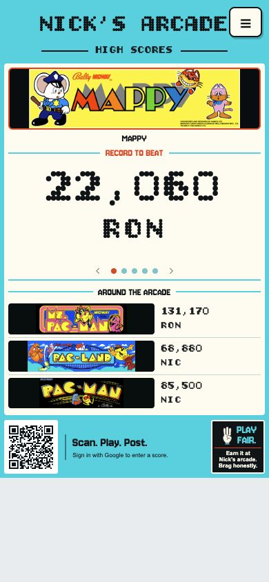
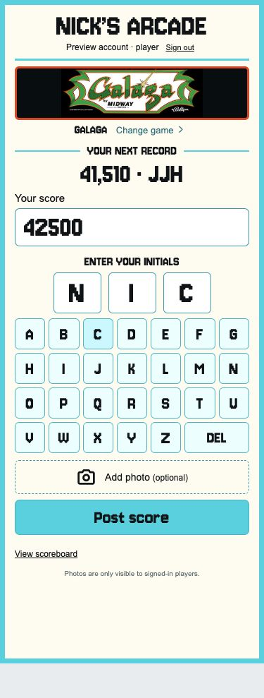
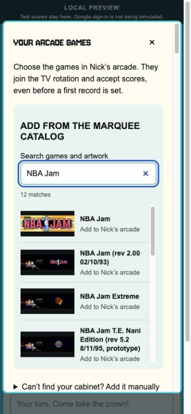

# Nick’s Arcade

A shared high-score board for Nick’s basement arcade: a rotating portrait display for the TV, and an arcade-style score-entry screen for friends’ phones.

**[Open the TV scoreboard](https://ronavis.github.io/nicks-arcade/#tv) · [Enter a score](https://ronavis.github.io/nicks-arcade/#play)**

> **Source status — October 1, 2026:** The rebuilt app is deployed. Its current source is on [`codex/arcade-record-spotlight`](https://github.com/ronavis/nicks-arcade/tree/codex/arcade-record-spotlight), in [pull request #1](https://github.com/ronavis/nicks-arcade/pull/1). Until that PR is merged, `master` still contains the original implementation. GitHub Pages serves the separate `gh-pages` branch. Use the source branch below for local development.

## Screenshots

<table>
  <tr>
    <th>Portrait scoreboard</th>
    <th>Arcade score entry</th>
    <th>Admin marquee search</th>
  </tr>
  <tr>
    <td align="center" valign="top"><a href="docs/screenshots/scoreboard-current.png"></a></td>
    <td align="center" valign="top"><a href="docs/screenshots/mobile-score-entry.png"></a></td>
    <td align="center" valign="top"><a href="docs/screenshots/marquee-catalog.png"></a></td>
  </tr>
</table>

Click a screenshot to open it. The scoreboard is a live 390 × 844 capture; marquee search is a 390 × 844 local admin preview. The score-entry screenshot is an earlier September 29 capture of the same initials-entry flow, before the latest typography updates. Preview examples did not create live records. All screenshots were captured September 29, 2026.

## How to play

1. Scan the QR code or open the main site to see the shared scoreboard on your phone or TV.
2. Use **Menu → My account** to sign in with Google. After sign-in you return to the main scoreboard. Choose **Menu → Enter a score** when you are ready to post. Your email does not appear on the public scoreboard.
3. Choose one of Nick’s approved arcade games. If a cabinet is missing, ask Nick or Ron to add it through **Manage games**. Admins can enable **Bypass my games restriction** to allow submissions for other games.
4. Enter your score and tap three letters on the arcade alphabet keypad. Use **DEL** to correct an initial.
5. Optionally attach a photo, then choose **Post score**.

Submissions do not wait for approval. A game’s first score becomes its record to beat. Later submissions replace the record only when they beat it; lower scores remain in history, and an equal score keeps the earlier entry. The public TV board refreshes every five seconds while its browser tab is visible.

Ron and Nick are the arcade administrators. Admin controls allow score corrections, removal, proof-photo viewing and a JSON export. Removing a winning score promotes the best remaining entry, and changes are retained in the audit history.

## Your account, notifications and friendly rivalry

**My account** is visible near the top of score entry and in the TV controls. When signed out, it takes you to Google sign-in; successful sign-in returns to the shared scoreboard. When already signed in, it opens your account. Reloading an existing signed-in score-entry or admin page preserves that page. It provides:

- **Notifications:** game marquee artwork with recent score submissions, first records and record breaks, with a red unread badge on both phone and TV **My account** buttons, and **Mark all read**. A player whose account held the previous record sees **Your record was broken**, the new score, previous record and challenger’s optional taunt.
- **My scores:** your recent submissions and linked imported records with game artwork, current-record status and attached proof photos. Removed entries are hidden here and retained in admin history.
- **Settings:** save three default initials for fresh entries, plus a default victory taunt and an on/off switch under **Set up your taunt**. Automatic taunts are off by default and accompany only a score that beats another player’s existing record. Turning the setting off preserves the saved text; players can edit or clear a taunt before posting. Admins can also save the shared TV rotation interval (5–120 seconds) and the **Bypass my games restriction** switch using **Save arcade settings**. Open displays receive timing changes within five seconds, and the setting survives restarts. Preferences and notification read status follow your Google account across devices.
- **Manage scores:** available to verified admins from My account and the TV’s three-line menu. Choose a game, see its artwork and current record, search submissions by initials/email/score, and edit or remove a score with a clear confirmation. Removed entries are hidden by default and can be included for review. Corrections can also edit or clear a taunt. Regular players and signed-out visitors do not see admin controls; the server independently enforces admin access.

- **Manage games:** available only to admins. Search the visual marquee catalog, add eligible cabinets before they have a score, or remove a game from the eligible collection while retaining its score history. See [Manage games](#manage-games-admins) below.

The optional **Victory taunt** is limited to 140 characters. Keep it friendly. Text is displayed as text, never interpreted as HTML. Removing a submission also removes it from the activity feed.

Notifications are inside the app; no email or phone push alerts are sent. The badge refreshes every 15 seconds while the page is visible, and the feed shows the latest 100 updates. Activity starts with submissions made after this feature was deployed. Imported starting records can be linked to a Google account through a private, administrator-configured initials crosswalk. Linking happens when that account next makes an authenticated request and preserves the original initials and score. Once linked, future record breaks can generate personal notices; earlier notices are not reassigned. New submissions always belong to the signed-in Google account, regardless of the initials entered. Ties and improvements to your own record do not create a personal “your record was broken” notice.

## The display and game collection

- Portrait 9:16 Record Spotlight design with turquoise and cream, game artwork, a prominent score and larger, spaced initials.
- Featured game changes every 15 seconds by default; admins can choose 5–120 seconds in Account → Settings → TV Display, with three neighboring records and a permanent QR code. Pause, previous/next, fullscreen and rotation controls are available. Automatic rotation respects the browser’s reduced-motion preference.
- The three-line menu keeps **Enter a score** first and visually emphasized for everyone, with left-aligned actions. Admin-only management actions appear only for verified admins. The menu is layered above the rotating leaderboard and marquees.
- The collection starts with Nick’s **32 imported records**, not a 32-game limit. **The Simpsons** is also available for its first entry. Admins approve additional cabinets through Manage games. Players can submit other games only while the shared bypass setting is enabled.
- Search ignores punctuation and spacing. Newly added games are saved in the shared database and become available on other devices, the TV and the admin screen.
- Catalog selections include their marquee artwork. Manual titles use matching curated artwork when available and a neutral graphic otherwise. Images load on demand; an unavailable image falls back to the neutral graphic. The game name is displayed separately.

## Photos from phones

Proof photos support **iPhone HEIC/HEIF, JPG, PNG and WebP**, up to **40 MB and 64 megapixels**. The server automatically resizes images to a maximum 1600-pixel edge, saves them as JPEG and removes EXIF metadata. Ordinary supported camera photos can be selected without changing camera settings.

A browser that cannot preview HEIC can still upload it. Photos are available only to signed-in players; they are not public scoreboard images. The original iPhone photo that prompted the compatibility fix still needs a user retry; HEIC and 48-megapixel JPEG conversion have passed automated and VPS checks.

## Where scores are saved

| Component | Purpose |
| --- | --- |
| GitHub Pages | Hosts the built HTML, CSS, JavaScript, fonts and game artwork. |
| Isolated Flask service on the VPS | Verifies Google sign-in, accepts scores/photos and enforces admin access. |
| SQLite database | Stores games, scores and admin audit history. |
| Private photo directory | Stores processed proof photos separately from the site’s public files. |

GitHub Pages does **not** run the database. Scores and photos live in persistent storage outside code releases, so rebuilding the website does not reset records. The browser keeps the current sign-in token in session storage; submitted scores are shared server data, not browser-local records.

A daily backup runs at **06:00 UTC** and includes the database, referenced photos and uploaded marquees. Backup/restore has been tested, including an off-host copy. Automatic off-host copying and backup retention cleanup are not configured. The admin JSON export is useful for inspection but does not include photo files and is not a full backup.

## Run locally

Verified with **Node.js 22 and Python 3.12**.

```sh
git clone --branch codex/arcade-record-spotlight https://github.com/ronavis/nicks-arcade.git
cd nicks-arcade
npm ci
npm run build
python3.12 -m venv .venv
.venv/bin/pip install -r tests/requirements.txt
ARCADE_DEMO=1 .venv/bin/python -m server.app
```

Open:

- `http://127.0.0.1:4173/?view=preview` — side-by-side TV and phone preview.
- `http://127.0.0.1:4173/#tv` — scoreboard.
- `http://127.0.0.1:4173/#play` — score entry.

Preview buttons create explicitly labeled **local test identities**, not Google sessions. Preview data is stored in `.local-preview/`, and the server binds only to loopback. The production application factory rejects demo mode.

A localhost QR code will not connect a separate phone to this computer. Use the public site for real phone testing. After a production build, run `npm run build` again without `ARCADE_API_BASE` before resuming local preview, so the preview connects to its local API.

## Build and validate

```sh
npm run check
npm test
npm run build
.venv/bin/python -m pytest -q
```

The September 30 validation passed **77 backend tests and 11 frontend tests**, covering persistence, new-game creation, concurrent submissions, duplicate retries, scoring/time rules, Google token validation, admin permissions, photo processing/privacy, origin restrictions, rate limits, backup/restore, collection eligibility, the bypass switch, catalog selection, celebration detection and date labels. All 33 supplied game entries were exercised in submission tests and browser search checks.

For a production frontend build:

```sh
ARCADE_API_BASE=https://midconversation.com/arcade-api npm run build
```

Publish **only `dist/`** to the existing `gh-pages` branch. Keep databases, proof photos, environment files and backend code out of that publication. Backend changes require a separate VPS release. The build copies curated game artwork, the neutral fallback and shared UI assets. The searchable catalog is served by the API; its wider artwork collection loads from pinned public GitHub image URLs. The full archive is not included in the Pages build.

## Validation status and remaining checks

Completed checks include real Google sign-in, phone QR scanning and score submission, live score/photo submission from a desktop browser, admin correction/removal, automatic record fallback, production restart persistence and backup restoration. The latest collection update was checked in the browser for catalog search, adding a cabinet without a score, first-score entry, bypass on/off, and regular-player restrictions. Mobile layouts were checked at 390 pixels wide. Published frontend files were verified against the production build.

Still to confirm:

- Retry the original iPhone photo against the updated uploader.
- Test Nick’s actual TV/browser for orientation, fullscreen, readability and sustained rotation.
- Have Nick sign in with his own Google account and confirm his admin controls. Ron/Nick role parity and regular-player restrictions pass automated tests; the agent has not performed Nick’s live Google sign-in.
- Verify the full regular-player flow with a second real non-admin Google account; local browser role checks pass.
- Resolve source-record questions with Nick: the exact Street Fighter edition.

Imported starting records have unknown original dates and are seeded once, not reset on restart. Earlier browser-local scores are not silently imported; preserve any such records before discarding an old browser session.

## Project documentation

These links point to the current source branch while the PR remains open:

- [Deployment, updates and recovery](https://github.com/ronavis/nicks-arcade/blob/codex/arcade-record-spotlight/deploy/README.md)
- [Launch validation record](https://github.com/ronavis/nicks-arcade/blob/codex/arcade-record-spotlight/deploy/launch-status.md)
- [Design and browser QA](https://github.com/ronavis/nicks-arcade/blob/codex/arcade-record-spotlight/design-qa.md)

## Artwork and packages

The favicon and iPhone home-screen icon use Ron’s supplied Nick’s Arcade token with a turquoise background matching the scoreboard. The original is preserved at `images/nicks-arcade-token.jpg`. Artwork comes from the existing repository, Nick’s shared presentation, and documented cabinet-marquee sources. The visual catalog contains **9,543 entries including variants**, with supplementary cabinet artwork for 1,685 exact matches. The rejected space-themed packs are blocked throughout the interface. Entries without an approved replacement use a neutral placeholder; catalog results label these “Marquee unavailable.” All games remain searchable. See [artwork sources](https://github.com/ronavis/nicks-arcade/blob/codex/arcade-record-spotlight/docs/artwork-sources.md). Game marks belong to their owners. The UI bundles Bitcount Grid Double and Jersey 10 (OFL), Phosphor icons (MIT) and QRCode (MIT), with notices in `dist/vendor/licenses/`. Backend dependencies, including Pillow and the HEIF decoder, are pinned in `server/requirements.txt`.

Scores, initials and the main Nick’s Arcade / High Scores branding use locally hosted Bitcount Grid Double with round dots and double-row strokes. Supporting display labels use Jersey 10. Font licenses are included in the published vendor/licenses directory.

### New-record TV celebrations

An open TV display checks the public leaderboard every five seconds. A newly submitted winning score triggers a silent, ten-second takeover with the marquee, initials, score, and optional taunt, then returns to the board. Faster times say “New record time.” The Back to scoreboard button dismisses it early. Existing records on initial load, admin corrections, and older fallback records do not trigger a takeover. Rotation waits during the celebration and an existing manual pause is preserved. Reduced-motion preferences disable the entrance animation.

This uses current winner snapshots: multiple games can queue, but intermediate records beaten between polls are not replayed. Events older than sixty seconds are skipped after a disconnection. No account is required on the TV.

Run `npm test` for celebration detection regression checks.

The featured record and celebration show a compact green dot-matrix improvement badge when the original previous record is known. Points use ↑ +2,400; timed records use ↓ 1.10s. Tap the badge for an explanation. Imported/first records and corrected submissions omit uncertain comparisons. Around the arcade rows remain unchanged.

Featured records show their submission date and elapsed days (“Set N days ago”). Undated imported records leave the date row blank without collapsing its space; corrected records use a submitted-date label. This measures time since submission, not a reconstructed continuous record reign. My scores includes submission timestamps. Empty games say “Set the first record”; Manage scores explains that there is no saved submission to edit/delete and offers Enter the first score.

### Manage games (admins)

Open **My account → Manage games**, or **Menu → Manage games** on the TV. Search a visual catalog of 9,543 entries, including game variants, and select a marquee to add a game. The existing 32 legacy-record games and The Simpsons are already in the shared collection. Both Ron and Nick manage the same arcade; adding games requires no score. New cabinets join rotation with “Be the first.” A manual entry option remains for missing cabinets and fastest-time scoring.

**Remove from arcade** removes eligibility and hides the game from the restricted scoreboard and player picker; scores remain in history. Admins can add it back. At least one game must remain eligible.

Under **My account → Settings → Arcade rules**, admins can enable **Bypass my games restriction**. It defaults to off. Off permits scores only for the approved collection, including for admins. On lets signed-in players browse the wider catalog or enter another title. Outside games are not automatically approved: turning bypass off hides them and blocks further scores while retaining their history. The server enforces this independently of the UI, and the setting persists across restarts.

Ron and Nick have the same admin permissions through their configured Google accounts. Personal scores, notifications, and preferences still belong to each signed-in account. Nick must use his own Google account.

Undated legacy records leave the date row blank while preserving its layout space.

Nick confirmed the imported 1,734,150 / RJW record belongs to **Puzzle Bobble**, displayed as **Puzzle Bobble** with a clean transparent logo at Ron’s request. Its historical internal game ID is retained to preserve score ownership and history.

Excitebike race times use minutes, seconds and hundredths: `1:02:30` and `1:02.30` both represent 62.30 seconds. The app accepts both and displays `1:02.30`; lower is better. [Nintendo’s VS. System description](https://www.nintendo.com/en-ca/store/products/arcade-archives-excitebike-switch/) confirms hundredth-of-a-second racing. Admin time fields explain this and save feedback includes the stored display value.

### Replace a game’s artwork

Admins can open **Menu → Manage games**, find the game, and select **Upload marquee**. Choose a saved JPG, PNG, WebP or iPhone HEIC image, then press **Use this marquee**. Images up to 40 MB and 64 megapixels are resized automatically; transparency is preserved and metadata is removed. The uploaded image overrides catalog artwork across the shared scoreboard, score entry, My scores, notifications and game management. It is stored on the server and included in backups, so it survives site updates. **Change marquee → Restore default artwork** removes the override. Regular players cannot change shared artwork.

### Record history in Manage scores

Each game now has a newest-first record timeline above its submission controls. It shows the original score and initials, the submitting Google account, and the local date/time for submissions recorded as new records. Lower scores and ties stay in the submission list without becoming record milestones. Faster times count as records for time-based games. Later corrections and removals are labeled, with original values recovered from the correction audit. Imported starting records show a linked player account when known and explicitly lack an original date. Older submissions without activity tracking are disclosed as a history gap rather than guessed. This view is admin-only.

### TV monitor orientation

Admins can open **Menu → TV setup** or **My account → Settings → TV monitor setup**. Choose 0°, 90°, 180° or 270°, then **Save for this TV**. The choice is stored in this browser, survives reopening with normal browser storage, and affects only its scoreboard—not entry/admin pages or other devices. The existing Rotate action cycles these four angles and remembers the choice too.

To prepare a TV from a phone, choose an angle and **Copy TV link**, without saving it on the phone. Bookmark that link or configure it as the TV browser’s startup page. The explicit `?tvRotation=90#tv` (or 0/180/270) angle takes priority over a stored preference and works without sign-in or persistent browser storage. The board’s QR code always opens the normal scoreboard URL on visitors’ phones. This configures page orientation; it does not turn on hardware, launch the browser or bypass browser restrictions on automatic fullscreen.

### Manage cabinets (October 1)

Admins have **Menu → Manage cabinets** and the same entry in My account. The gallery is separate from Manage games. Create or rename a cabinet, upload an optional photo, and select it to see its games with marquee artwork. On phones, selecting a cabinet opens its detail view with **Back to cabinets**.

**Add games** searches the existing collection and the marquee catalog. Catalog additions also join the eligible game collection. **Assigned cabinets** in Manage games lets you check multiple cabinets for a game. Unchecking a cabinet changes only that relationship: scores, history, other assignments and game eligibility are preserved. Cabinet assignments do not replace the existing eligible-game restriction.

The one-time migrations import 18 named cabinets and the confirmed game assignments from Nick’s October 1 email attachment, `Nick's Arcade List.xlsx`. A fresh database has 98 games: the original 33 plus 65 missing titles, with no invented scores. Reviewed title aliases reuse existing records; Nintendo Vs. entries remain separate from ambiguous legacy Nintendo titles. MC2 lacks a cabinet description, and five titles have no cabinet assignment, so those remain unresolved. An upgrade preserves existing scores, uploaded marquees, eligibility choices and administrator-edited assignments. Imported links are not recreated on later restarts. This is a copied starting inventory, not a live Google Sheet sync.

The 18 seeded cabinets include real reference cabinet images. Nick’s uploaded photo takes priority; newly added cabinets without a matching reference still use the neutral illustration. Reference images represent cabinet types, not verified photos of Nick’s exact machines. See [cabinet image sources](docs/cabinet-art-sources.md). Photos accept JPG, PNG, WebP and iPhone HEIC up to 40 MB / 64 megapixels; they are resized to 1200 px and stripped of metadata. Current cabinet photos have public image URLs. Cabinet management is admin-only, enforced on the server. Assigned cabinet names and current photos are public so visitors can find each game. Optimistic conflict checks prevent stale edits from overwriting newer cabinet names/photos or game assignments.

Cabinet tables, assignments and audit history live in the existing persistent SQLite database. Cabinet photos and replacement history are included by `scripts/backup.py`. The cabinet-aware backend and frontend were published together on October 1.

### Collection artwork audit

The October 1 cabinet preview's full 98-game collection now has artwork coverage, including imported games without scores. A full pass replaced 59 neutral fallbacks with 58 game-specific marquees/logos and shared Space Invaders artwork for the Color edition. New assets are optimized WebP files. The 9,543-entry search library still has uncovered variants; this is collection coverage, not a claim of complete library coverage. Sources and exceptions are documented in `docs/artwork-sources.md`, with per-image provenance in `data/artwork-provenance.json`.

Run `npm run build` followed by `npm run audit:artwork -- http://127.0.0.1:4174` to check every game and image response in a running local preview. The complete collection artwork set is included in the October 1 release.

### Import your arcade from a spreadsheet

Admins can open **Manage games → Import spreadsheet**. Download the [Excel template](templates/arcade-inventory-template.xlsx) or [CSV template](templates/arcade-inventory-template.csv). Replace the example rows with your own collection; upload the Excel template directly, or export the Games sheet as **CSV UTF-8, comma separated**. Excel imports read only the worksheet named **Games**; Instructions and review questions are ignored. Nick’s original two-tab layout still needs conversion to the template.

| Column | What to enter |
|---|---|
| Game | Required game title. Use the exact existing title to reuse it. |
| Cabinet 1–4 | Cabinet names, not lookup codes. Leave blank for an unassigned game. Repeat a game on more rows if needed. |
| Scoring | `points` (highest wins) or `time` (lowest wins). Blank preserves an existing game's scoring type, or defaults a new game to points. |

Preview shows each row, artwork where available, new/reused games, cabinet assignments and errors. **Import additions** saves only when all rows are valid. New games join the eligible collection without invented scores. Existing game eligibility, score history, uploaded artwork and cabinet relationships remain unchanged. Duplicate rows and repeat imports do not duplicate entries. Scoring conflicts require a corrected file; imports cannot change an existing game's scoring type. If relevant collection data changes after preview, preview again. Imports are transactional and audit the acting admin. Limit: 500 rows and 256 KB per CSV.

These imports update the current arcade; they do not create separate user-owned arcades or tenants. Unknown artwork uses the neutral placeholder and can be replaced through Upload marquee. The importer and templates are available in the October 1 release.

### Nick’s populated inventory snapshot

Download the [October 1 review workbook](templates/nicks-arcade-inventory-2026-10-01.xlsx) or [matching import CSV](templates/nicks-arcade-inventory-2026-10-01.csv). The workbook contains the live collection’s **98 games, 18 cabinets and 122 assignments**, plus a Questions for Nick sheet and import instructions. It is a dated snapshot, not a synchronized feed. Unresolved source entries are listed as questions rather than invented assignments. Use the blank template above for another collection.

October 1 validation: **85 backend tests and 11 frontend tests passed**, including additive imports, role checks, stale previews, duplicate imports, cabinet mappings and preservation of existing records.

### Choose games for the leaderboard

In **My account → Manage games**, admins can change **Show on leaderboard** for each game. This controls the featured rotation, neighboring records and celebrations independently of score-entry eligibility. New games (including spreadsheet imports) default to unchecked. On upgrade, existing games with active scores remain checked; games without scores start unchecked. Posting a score does not change the admin’s selection. Settings persist across restarts and apply to all screens on their next refresh. If every game is unchecked, the board shows Coming soon.

Excel imports accept `.xlsx` files up to 2 MB and CSV up to 256 KB, with 500 game rows maximum. Use plain values rather than formulas. The same preview, duplicate detection and additive-save protections apply to both formats.

### Find the featured game

The featured record includes a **Play it on** strip with up to four equal-sized cabinet images. Smaller groups stay centered at the same size. Tap an image to see the full cabinet list. The featured strip uses equal framed close-ups of cabinet marquees, screens and controls. Tap a tile to see the full cabinet photos. The strip reserves its space across game changes. Real reference images are bundled with the site, so their display does not depend on third-party image hosts.
